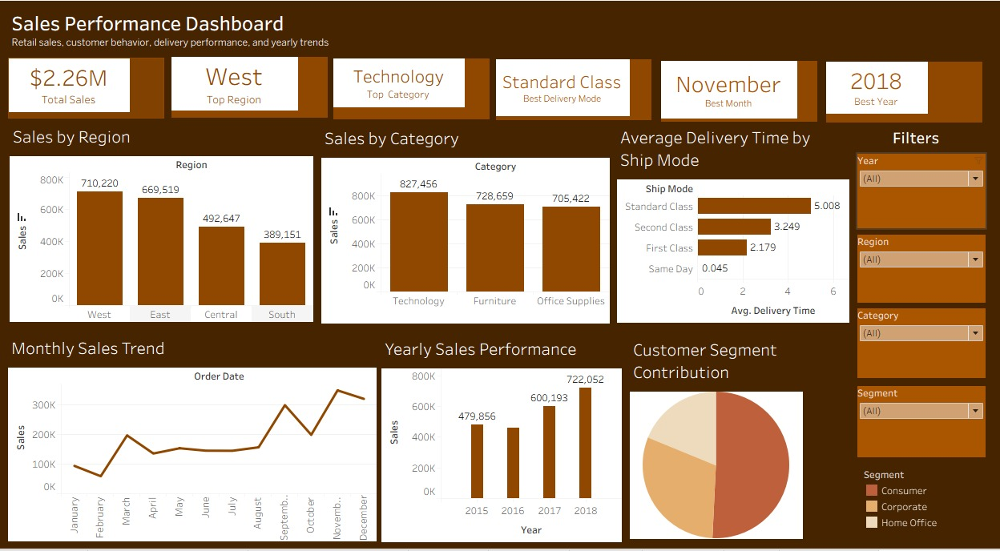

# Sales Performance Dashboard | Tableau Project

## Project Overview

This project involved the analysis and visualization of a retail sales dataset containing sales records from 2015 to 2018. The purpose of this project was to transform raw sales data into meaningful business insights using data cleaning, analysis, and interactive dashboard design.

The final output is an interactive Tableau dashboard that presents key business performance metrics across regional sales, product categories, customer segments, monthly and yearly trends, and delivery performance by shipping mode.

The dashboard was published on Tableau Public to make it accessible and interactive for viewers. Tableau Public allows users to save and share visualizations publicly online. :contentReference[oaicite:1]{index=1}

## Dashboard Preview

## Live Dashboard

View the interactive Tableau dashboard here:  
[[Tableau Public Dashboard]((https://public.tableau.com/views/SalesPerformanceDashboard_17800779831720/SalesPerformanceDashboard?:language=en-US&publish=yes&:sid=&:redirect=auth&:display_count=n&:origin=viz_share_link)
)]

## Project Objectives

The main objectives of this project were to:

- Clean and prepare the retail sales dataset for analysis
- Identify sales patterns and business trends across different performance areas
- Analyze regional sales, product category performance, customer segments, monthly trends, yearly trends, and shipping performance
- Build an interactive Tableau dashboard for easier business decision-making
- Improve dashboard storytelling through KPI cards, filters, and visual design

## Dataset Information

**Dataset used:** Superstore Sales Dataset  
**Period covered:** 2015–2018

### Key Dataset Columns

- Order Date
- Ship Date
- Region
- Category
- Segment
- Sales
- Ship Mode

## Tools Used

- Microsoft Excel
- Tableau Public
- Tableau Dashboard Design
- Tableau Filters
- KPI Cards
- Data Visualization Techniques

## Dashboard Features

The Tableau dashboard includes:

- Total Sales KPI
- Top Region KPI
- Top Category KPI
- Best Delivery Mode KPI
- Best Month KPI
- Best Year KPI
- Sales by Region chart
- Sales by Category chart
- Monthly Sales Trend line chart
- Yearly Sales Performance chart
- Customer Segment Contribution pie chart
- Average Delivery Time by Ship Mode chart
- Interactive filters for Year, Region, Category, and Segment

## Key Insights and Findings

### Regional Performance

The West region generated the highest revenue, making it the top-performing region and the strongest contributor to overall sales.

### Product Category Performance

Technology was the highest sales-generating product category, showing strong customer demand and revenue contribution.

### Seasonal Sales Trend

Sales increased significantly toward the end of the year. November recorded the strongest monthly sales performance, followed by high activity around the holiday season.

### Yearly Performance

2018 was the best-performing year in the dataset, showing the highest annual sales value compared to previous years.

### Customer Segment Contribution

The Consumer segment contributed the highest share of sales, making it an important customer group for business retention and growth.

### Delivery Performance

Standard Class was the leading shipping mode and also recorded the longest average delivery time. This suggests that while it is widely used, there may be opportunities to improve delivery efficiency.

## Recommendations

Based on the analysis, the following recommendations were made:

- Increase marketing efforts in the low-performing region to boost sales in those sectors.
- Explore methods to improve delivery efficiency for slower shipping modes
- Focus on ways to retain the consumer segment, as they generate the highest revenue, and also explore ways to satisfy other segments in the customer base to increase sales
- Increase the production level of the technology products, as it generates more revenue.
- Prepare for the seasonal periods (end of the year) demands for smooth running
- Use interactive dashboards regularly to monitor performance and support data-driven business decisions.

## Conclusion

This project transformed raw retail sales data into clear and useful business insights using Tableau. The dashboard provides a summarized and interactive view of sales performance, customer behavior, delivery trends, and yearly growth.

Through this project, I strengthened my skills in Tableau dashboard design, KPI creation, interactive filtering, visual storytelling, and business insight communication. Tableau dashboard best practices emphasize clear goals, effective layout, and visual simplicity, which guided the final dashboard design. :contentReference[oaicite:2]{index=2}
